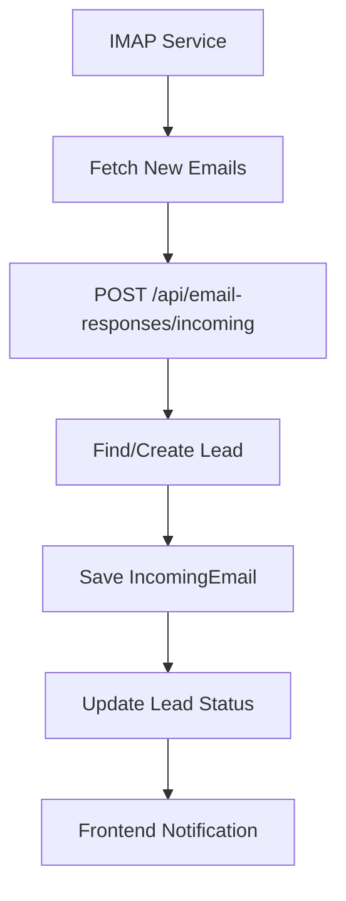
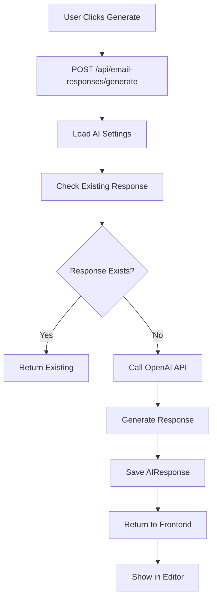
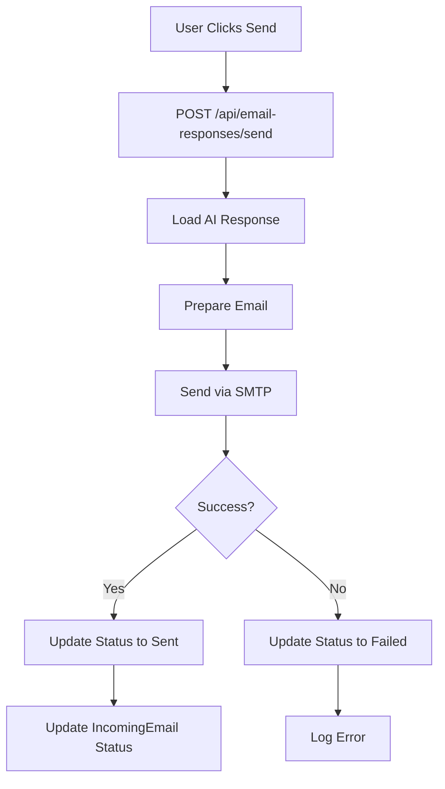

# Email Response System Documentation

## Overview

The Email Response System is an AI-powered automated email management solution that processes incoming emails from leads and generates intelligent responses. The system integrates with IMAP email fetching, uses OpenAI GPT-4 for response generation, and provides a comprehensive web interface for monitoring and managing email interactions.

## System Architecture

### Core Components

1. **Frontend Interface** (`app/email-responses/page.tsx`)
   - React-based dashboard for email management
   - Real-time email monitoring and filtering
   - AI response generation and editing
   - Settings configuration

2. **Backend APIs** (`app/api/email-responses/`)
   - `/incoming` - Email storage and retrieval
   - `/generate` - AI response generation
   - `/send` - Email sending functionality
   - `/settings` - Configuration management
   - `/ai-responses` - Response tracking

3. **Database Models** (`models/emailResponseSchema.ts`)
   - `IncomingEmail` - Stores received emails
   - `AIResponse` - Stores generated responses

4. **External Services**
   - OpenAI GPT-4 for response generation
   - SMTP service for email sending
   - IMAP service for email fetching

## Data Flow

### 1. Email Reception Flow



### 2. AI Response Generation Flow



### 3. Email Sending Flow



## Detailed Component Analysis

### Frontend Interface (`app/email-responses/page.tsx`)

#### Key Features:
- **Email Dashboard**: Real-time monitoring of incoming emails
- **Tabbed Interface**: Inbox, Unread, Pending AI, Responded
- **Email Preview**: Detailed view of email content and metadata
- **AI Response Editor**: Edit and customize generated responses
- **Settings Panel**: Configure AI behavior and company information

#### State Management:
```typescript
interface IncomingEmail {
  id: string;
  leadId: string;
  leadName: string;
  leadEmail: string;
  leadCompany: string;
  subject: string;
  content: string;
  receivedAt: string;
  status: 'unread' | 'read' | 'responded' | 'pending_ai';
  sentiment: 'positive' | 'negative' | 'neutral' | 'interested' | 'not_interested';
  isReply: boolean;
  isRecent: boolean;
  threadId?: string;
}

interface AIResponse {
  id: string;
  incomingEmailId: string;
  generatedSubject: string;
  generatedContent: string;
  confidence: number;
  reasoning: string;
  status: 'draft' | 'approved' | 'sent' | 'rejected';
  createdAt: string;
  sentAt?: string;
  responseType: 'interested' | 'objection_handling' | 'meeting_request' | 'pricing_inquiry' | 'general';
}

interface AISettings {
  isEnabled: boolean;
  autoSendThreshold: number;
  defaultTone: 'professional' | 'friendly' | 'casual' | 'formal';
  includeCompanyInfo: boolean;
  maxResponseLength: number;
  customInstructions: string;
  responsePrompt: string;
  companyName: string;
  senderName: string;
  senderEmail: string;
  signature: string;
}
```

### Backend APIs

#### 1. Incoming Email API (`/api/email-responses/incoming`)

**POST**: Saves new incoming emails
- Validates required fields (leadEmail, subject, content)
- Finds or creates associated lead
- Saves email with metadata
- Returns success confirmation

**GET**: Retrieves paginated email list
- Supports pagination (limit, page)
- Returns filtered and formatted email data
- Includes sentiment analysis

**PUT**: Updates email status
- Updates status (unread, read, responded)
- Updates sentiment analysis
- Tracks processing timestamps

#### 2. AI Generation API (`/api/email-responses/generate`)

**POST**: Generates AI response
- Validates incoming email ID
- Checks for existing responses
- Loads AI settings from database
- Calls OpenAI API with configured prompt
- Saves generated response
- Returns response with confidence score

#### 3. Send Email API (`/api/email-responses/send`)

**POST**: Sends AI response
- Validates response ID
- Prepares email with custom content
- Sends via SMTP service
- Updates response and email status
- Handles success/failure scenarios

### Database Schema

#### IncomingEmail Collection
```javascript
{
  leadId: ObjectId,           // Reference to Lead
  leadName: String,           // Sender name
  leadEmail: String,          // Sender email
  subject: String,            // Email subject
  content: String,            // Email body
  htmlContent: String,        // HTML version
  status: String,             // unread/processing/responded/failed
  receivedAt: Date,           // Timestamp
  respondedAt: Date,          // Response timestamp
  isReply: Boolean,           // Is reply to our email
  isRecent: Boolean,          // From last 20 minutes
  threadId: String,           // Email thread ID
  sentiment: String,          // positive/negative/neutral/interested/not_interested
  metadata: Object            // Email headers and metadata
}
```

#### AIResponse Collection
```javascript
{
  incomingEmailId: ObjectId,  // Reference to IncomingEmail
  generatedSubject: String,    // Generated subject line
  generatedContent: String,    // Generated response content
  reasoning: String,          // AI reasoning for response
  status: String,             // sending/sent/failed
  responseType: String,       // ai_generated/fallback
  sentAt: Date,              // Sent timestamp
  sentMessageId: String,      // SMTP Message-ID
  lastError: String           // Error message if failed
}
```

## AI Configuration System

### Response Prompt Structure
The system uses a sophisticated prompt structure that includes:

1. **Critical Directives**: Mandatory rules for response generation
2. **Persona Definition**: AI behavior and tone guidelines
3. **Response Structure**: Step-by-step response format
4. **Signature Requirements**: Mandatory signature format
5. **Meeting Booking**: Automatic booking link inclusion

### Example Prompt Structure:
```
**CRITICAL DIRECTIVES:**
1. SIGNATURE: Must end with exact signature
2. NO PLACEHOLDERS: Generate natural content
3. TONE: Warm, human, helpful, no sales pressure

**Your Persona:** Calm, engaged entrepreneur

**Response Structure:**
1. Acknowledge with genuine attention
2. Ask open-ended follow-up question
3. Gently suggest Zoom call (if appropriate)
4. End with friendly, open tone

**PERFECT RESPONSE EXAMPLE:** [Template response]
```

### Settings Management
- **Auto-send Threshold**: Confidence level for automatic sending
- **Default Tone**: Professional, friendly, casual, formal
- **Response Length**: Maximum character limit
- **Company Information**: Name, sender details, signature
- **Custom Instructions**: Additional AI guidelines

## Email Processing Workflow

### 1. Email Reception
1. IMAP service fetches new emails
2. Email is parsed and validated
3. Lead is found or created
4. Email is saved with metadata
5. Sentiment is analyzed
6. Frontend is updated

### 2. Response Generation
1. User selects email for response
2. System checks for existing response
3. AI settings are loaded from database
4. OpenAI API is called with configured prompt
5. Response is generated and saved
6. User can edit and customize response

### 3. Email Sending
1. User reviews and edits response
2. System prepares email with custom content
3. SMTP service sends email
4. Status is updated in database
5. Lead status is updated
6. Success/failure is logged

## Security and Validation

### Input Validation
- Email format validation
- Required field checking
- Content length limits
- XSS prevention

### Error Handling
- API timeout handling (15 seconds)
- OpenAI API error management
- SMTP failure recovery
- Database connection error handling

### Data Protection
- Email content encryption
- Secure API key storage
- Database access controls
- Audit logging

## Performance Optimizations

### Database Indexing
```javascript
// Performance indexes
incomingEmailSchema.index({ status: 1, receivedAt: -1 });
incomingEmailSchema.index({ isReply: 1, isRecent: 1 });
incomingEmailSchema.index({ leadEmail: 1, threadId: 1 });
aiResponseSchema.index({ incomingEmailId: 1 });
```

### Caching Strategy
- AI settings cached in memory
- Email list pagination
- Response generation caching
- Frontend state management

### API Optimization
- Request timeout handling
- Batch processing for multiple emails
- Async/await pattern usage
- Error recovery mechanisms

## Monitoring and Analytics

### Key Metrics
- Total emails received
- Response generation success rate
- Email sending success rate
- Average response time
- AI confidence scores
- Sentiment analysis accuracy

### Logging
- Email reception logs
- AI generation logs
- SMTP sending logs
- Error tracking
- Performance metrics

## Integration Points

### External Services
1. **IMAP Service**: Email fetching
2. **OpenAI API**: Response generation
3. **SMTP Service**: Email sending
4. **MongoDB**: Data storage

### Internal Systems
1. **Lead Management**: Lead creation and updates
2. **CRM System**: Lead status tracking
3. **Email Automation**: Campaign integration
4. **Dashboard**: Analytics and reporting

## Configuration Requirements

### Environment Variables
```bash
OPENAI_API_KEY=your_openai_api_key
MONGODB_URI=your_mongodb_connection_string
SMTP_HOST=your_smtp_host
SMTP_PORT=587
SMTP_USER=your_smtp_username
SMTP_PASS=your_smtp_password
```

### Required Setup
1. OpenAI API key configuration
2. MongoDB database setup
3. SMTP email service configuration
4. IMAP email fetching service
5. Frontend environment variables

## Troubleshooting Guide

### Common Issues

1. **AI Response Generation Fails**
   - Check OpenAI API key
   - Verify API quota
   - Check prompt configuration
   - Review error logs

2. **Email Sending Fails**
   - Verify SMTP credentials
   - Check email format
   - Review firewall settings
   - Check rate limits

3. **Database Connection Issues**
   - Verify MongoDB URI
   - Check network connectivity
   - Review authentication
   - Check database permissions

### Debug Tools
- API endpoint testing
- Database query logging
- Email sending simulation
- AI response testing
- Performance monitoring

## Future Enhancements

### Planned Features
1. **Advanced AI Models**: GPT-4 Turbo integration
2. **Multi-language Support**: International email handling
3. **Advanced Analytics**: Response effectiveness tracking
4. **Integration APIs**: Third-party CRM connections
5. **Mobile App**: Native mobile interface

### Scalability Improvements
1. **Microservices Architecture**: Service decomposition
2. **Message Queues**: Async processing
3. **Load Balancing**: Horizontal scaling
4. **Caching Layer**: Redis integration
5. **CDN Integration**: Static asset optimization

## Conclusion

The Email Response System provides a comprehensive solution for automated email management with AI-powered response generation. The system is designed for scalability, reliability, and ease of use, with robust error handling and monitoring capabilities.

The modular architecture allows for easy maintenance and future enhancements, while the comprehensive documentation ensures proper system understanding and troubleshooting capabilities. 